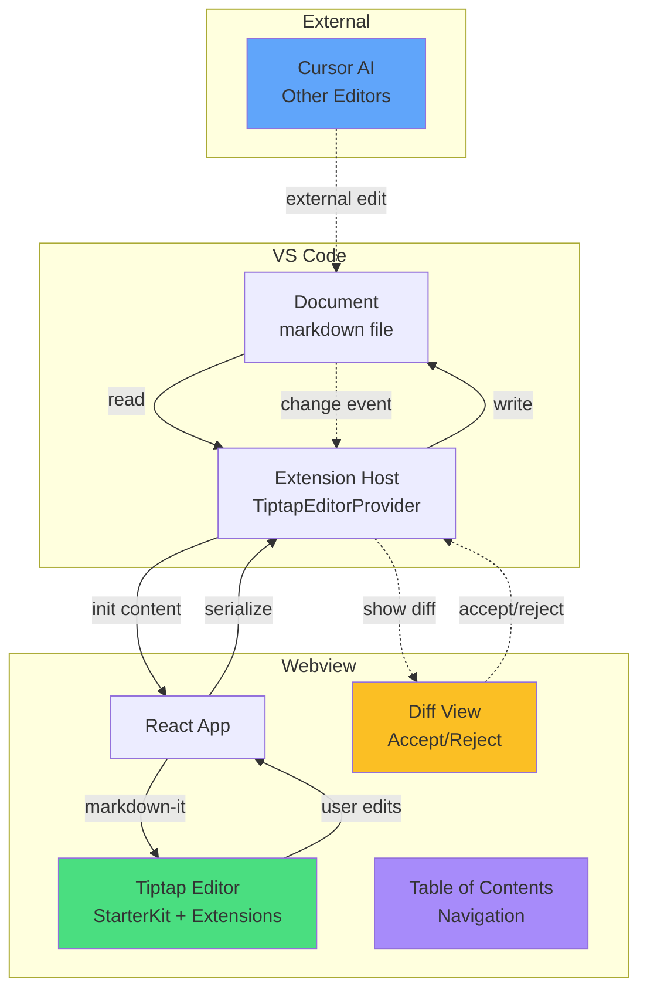

# TippyTap - WYSIWYG Markdown Editor for VS Code

A powerful VS Code extension that transforms markdown editing with a modern WYSIWYG editor powered by [Tiptap](https://tiptap.dev). Edit markdown files visually with real-time preview, smart diff detection for AI edits, and seamless integration with Cursor IDE.

## Architecture



## Features

### Rich Text Editing

- **Visual markdown editing** with real-time formatting


- **StarterKit extensions** including bold, italic, headings, lists, code blocks, blockquotes, and more


- **Tables** with resizable columns, add/remove rows and columns


- **Intuitive toolbar** with quick access to all formatting options


- **Keyboard shortcuts** for efficient editing


- **File handler** for drag-and-drop image uploads


### Smart Diff View

- **AI-powered diff detection** when Cursor AI or other tools modify your files


- **Visual changes** with red highlights for deletions and green for additions


- **Accept/Reject controls** to review and approve changes


- Works seamlessly with Cursor’s AI agent


### Additional Features

- **Table of Contents** sidebar showing all headings with quick navigation


- **Raw markdown toggle** to view and edit source directly


- **Auto-save** with bidirectional sync


- **Theme integration** adapts to VS Code’s light and dark themes


- **Undo/redo** support with full history


- **Mermaid diagram rendering** with editable code view for visual charts and diagrams


## Usage

### Opening Files

1. Open any `.md` file in VS Code


2. **Right-click** the file → **“Open With…”** → **“TippyTap”**


3. Start editing with the visual interface


### Making it Default

To always open markdown files with TippyTap:

1. Right-click any `.md` file


2. Select **“Open With…”** → **“TippyTap”**


3. Click **“Configure default editor for ‘\*.md’…”**


### Toolbar Features

Use the toolbar buttons to:

- **📑 ToC** - Toggle table of contents sidebar


- **↶ ↷** - Undo and redo your changes


- **B I S <>** - Format text (bold, italic, strikethrough, inline code)


- **H1 H2 H3** - Create headings


- **• List / 1. List** - Insert bullet or numbered lists


- **{ } ❝❞ ―** - Add code blocks, blockquotes, and horizontal rules


- **⊞** - Insert tables (3x3 with header row)


- **⫴ ⫵ ⊠** - Add columns, add rows, delete table


### Working with Tables

1. Click **⊞** to insert a new table


2. Click inside cells to edit content


3. Use **⫴** and **⫵** to add columns and rows


4. Click **⊠** to delete the entire table


5. Drag column edges to resize


### Working with Images

- **Drag and drop** images directly into the editor


- **Paste** images from clipboard


- Supports PNG, JPEG, GIF, and WebP formats


### Working with Mermaid Diagrams

1. Diagrams render automatically as visual graphics


2. Click the **</>** button on a diagram to view/edit code


3. Edit the mermaid syntax in the textarea


4. Click **“Save & Preview”** to re-render


5. Click **“Cancel”** to discard changes


### Reviewing AI Changes

When Cursor AI or external tools modify your file:

1. The diff view appears automatically


2. Review changes with red (removed) and green (added) highlights


3. Click **✓ Accept** to keep changes or **✗ Reject** to revert


## Development

### Setup

```bash
npm install
npm run watch
```

### Testing

Press **F5** in VS Code to launch an Extension Development Host window with the extension loaded.

### Building

```bash
npm run build        # Build once
npm run package      # Create .vsix package
npm run reinstall    # Build, package, and open for installation
```

## Documentation

- [Installation Guide](INSTALL.md) - Detailed installation instructions


- [Usage Guide](USAGE.md) - Complete feature documentation


- [Implementation Details](IMPLEMENTATION.md) - Technical architecture


## Requirements

- VS Code 1.80.0 or higher


- Works in Cursor IDE


## License

MIT (add LICENSE file for distribution)

## Contributing

Contributions are welcome! This extension uses:

- [Tiptap](https://tiptap.dev) v3.10.7 for rich text editing


- [ProseMirror](https://prosemirror.net) for document model


- [markdown-it](https://github.com/markdown-it/markdown-it) for markdown parsing


- [Mermaid](https://mermaid.js.org) for diagram rendering


